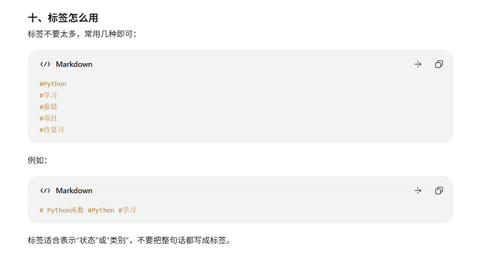
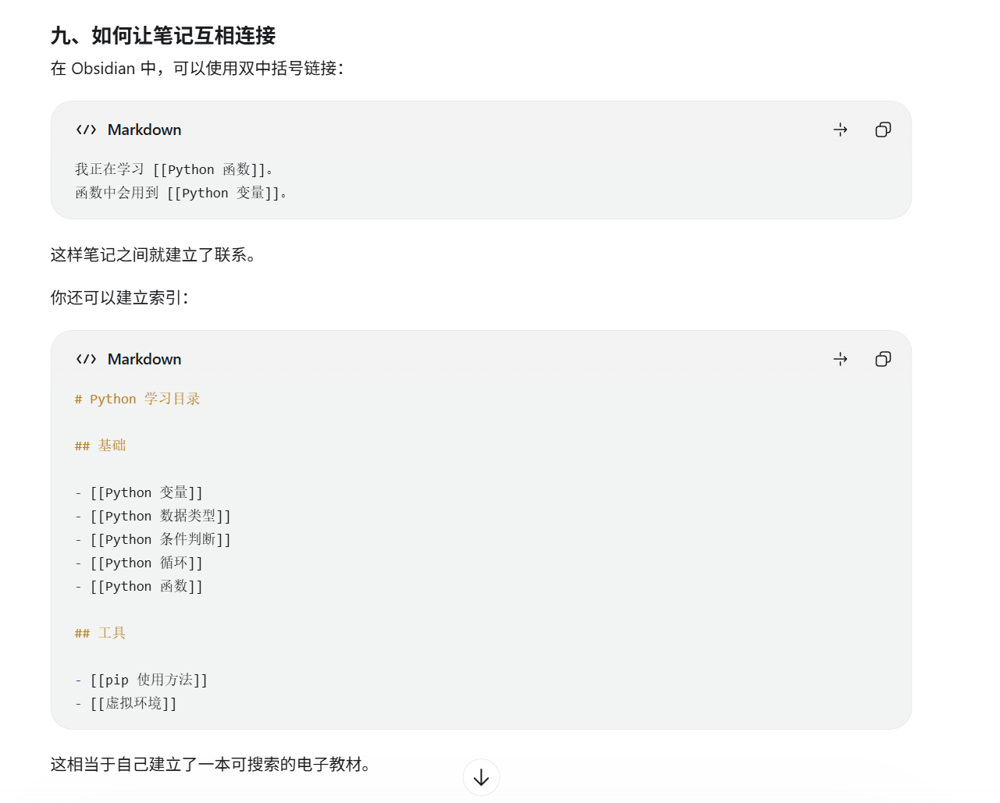

# 1.标题写法
# 1个井号+空格--一级标题
## 2个井号+空格--二级标题

最多6级标题

# 2.
### 标签

### 列表
-    - + 空格  无序列表
1.  1. +空格  有序列表


### 链接
两个中括号是 Obsidian 的内部链接写法；在 GitHub 中应改成普通 Markdown 链接：

```markdown
[跳转到另一个链接](跳转到另一个链接.md)
```


**外部链接**
```markdown
[Python 官网](https://www.python.org/)
```
[Python 官网](https://www.python.org/)


### 高亮与加粗
<mark>两个等号是高亮</mark>
**两个星号或者下划线是  加粗**      或者ctrl+B
_1个星号或者下划线是  斜体_
~~两个波浪线是  删除~~

### 任务清单：
Markdown 写法如下：

```markdown
- [ ] 未完成的任务
- [x] 已完成的任务
```

- [ ] 学习变量
- [x] 学习函数

### 代码
行内代码：

```markdown
使用 `print()` 输出内容。
```
使用 `print()` 输出内容。


多行代码：
````
```python
name = "小明"
print(name)
```
````

```python
name = "小明"
print(name)
```


代码块第一行写语言名称，例如：
````
```markdown
```python
```javascript
```html
```css
```
````


```python
```javascript
```html
```css
````


### 图片

```markdown

```

在 Obsidian 里，通常直接把图片拖进笔记即可。

### 引用

```
> 先让程序运行起来，再考虑优化。
```
> 先让程序运行起来，再考虑优化。

### 注释
[^1]:这是一个注释    [^1]:


### 表格
Obsidian右键+插入+表格

### 分隔线

```
---
```
--- 


# 3.快捷键

ctrl +p 直接搜索，然后会出现快捷键
ctrl +o 切换笔记


